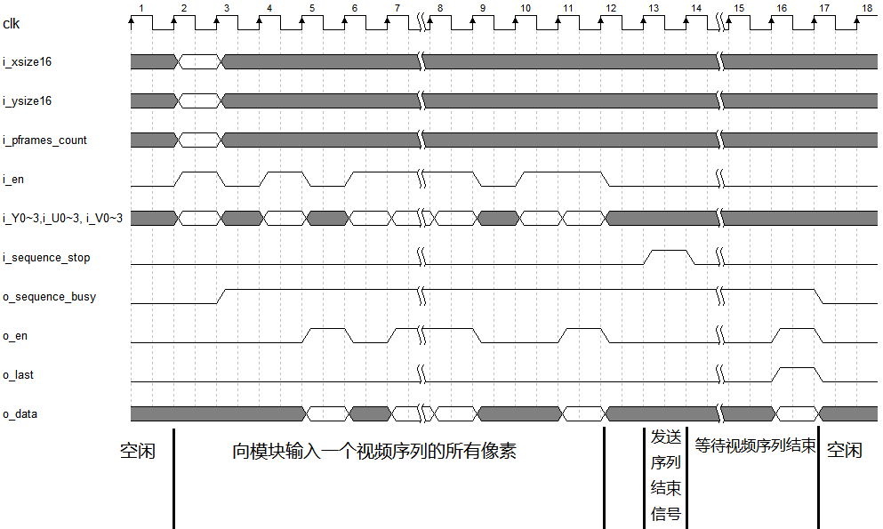

 -CAD09D.svg)  

中文 | [English](#en)

　

FPGA MPEG2 video encoder
===========================

基于 **FPGA** 的**高性能 MPEG2** 视频编码器，可实现视频压缩。特点：

* **输入**：YUV 444 原始像素
  * 按逐帧、逐行、逐列的顺序输入。
  * 每时钟周期可输入一行内相邻的 4 个像素，无反压握手 (无需停顿，任何周期都可以输入像素) 。
  * 每个像素包含 8-bit Y (明度) 、8-bit U (蓝色度) 、8-bit V (红色度) 。
* **输出**： 完整的 MPEG2 码流
  * 输出端口宽度为 256-bit ，每周期可能输出 32 字节
  * 将这些字节存储于文件后，可使用视频播放软件 (例如 Windows Media Player) 打开和查看
* **代码兼容性**：纯 RTL (SystemVerilog 2005) 编写，适用于各种厂家和型号的 FPGA 
* **性能** ：
  * 每周期可输入 4 个像素
  * 在 Xilinx Kintex-7 XC7K325TFFV676-1 上最大时钟频率为 67MHz 
  * 吞吐率达到 67*4= **268 MPixels/s** 。对 1920x1152 的视频的编码帧率为 121 帧/秒
* **FPGA资源消耗**：
  * **无需外部存储器**
  * 典型配置在 Xilinx 7 系列 FPGA 上消耗 **134k LUT**, **125 个 DSP48E**, **405个 BRAM36K** 
* **支持的 MPEG2 功能**：
  * 把输入的原始 YUV444 降采样为 YUV420 ，然后进行 MPEG2 压缩。
  * I 帧和 P 帧
  * P帧的动作估计 (motion estimate)：最多支持上下左右各 6 个像素的搜索范围，支持半像素 (half pixel) 搜索
  * 离散余弦变换 (DCT)
  * 量化 (quantize) ：支持四种量化级别，越大则压缩率越高，但输出视频质量越差
  * zig-zag 重排序、编码、输出。
  * 反量化 (inverse quantize) 和反余弦变换 (inverse DCT) ，将重建图象存入 BRAM ，作为下一帧的动作估计的参考帧
* **不支持的 MPEG2 功能** ：
  * 不支持 B帧，因为会消耗太多的 BRAM 。
  * 不支持码率控制 (rate control) ，而是固定质量 (采用固定的量化级别)
* **静态可调参数** (综合前确定，部署后不可调) ：
  * 视频的最大宽度、最大高度：越大则消耗 BRAM 越多
  * 动作估计的搜索范围：越大则压缩率越高，但消耗 LUT 越多
  * 量化级别 ：越大则压缩率越高，但输出视频质量越差
* **动态可调参数** (可在运行时针对每个视频序列进行调整) ：
  * 视频的宽度和高度
  * I帧间距 (两个I帧之间P帧的数量) ：越大则压缩率越高。
* **后续工作**：
  * 对 LUT 和 DSP 资源的优化。因为该模块目前消耗资源还不够小，一般只适用于 Xilinx Kintex-7 这种规模 (或更大规模) 的 FPGA。后续优化后，希望能部署在中等规模的 Artix-7 上。

　

# 目录

- [模块使用方法](#模块使用方法)
  - [模块参数](#模块参数)
  - [模块接口](#模块接口)
  - [示例波形](#示例波形)
- [综合结果](#综合结果)
- [仿真](#仿真)
- [与其它视频编码格式的对比](#与其它视频编码格式的对比)
- [附：RGB 转 YUV](#rgb2yuv)

　

# 模块使用方法

[RTL/mpeg2encoder.sv](./RTL/mpeg2encoder.sv) 是 MPEG2 编码器的顶层模块 (单模块设计，没有子模块) ，其参数和接口如下：

```verilog
module mpeg2encoder #(
    parameter  XL           = 6,   // determine the max horizontal pixel count.  4->256 pixels  5->512 pixels  6->1024 pixels  7->2048 pixels .
    parameter  YL           = 6,   // determine the max vertical   pixel count.  4->256 pixels  5->512 pixels  6->1024 pixels  7->2048 pixels .
    parameter  VECTOR_LEVEL = 3,   // motion vector range level, must be 1, 2, or 3. The larger the XL, the higher compression ratio, and the more LUT resource is uses.
    parameter  Q_LEVEL      = 2    // quantize level, must be 1, 2, 3 or 4. The larger the Q_LEVEL, the higher compression ratio and the lower quality.
) (
    input  wire        rstn,                     // =0:async reset, =1:normal operation. It MUST be reset before starting to use.
    input  wire        clk,
    // Video sequence configuration interface. --------------------------------------------------------------------------------------------------------------
    input  wire [XL:0] i_xsize16,                // horizontal pixel count = i_xsize16*16 . valid range: 4 ~ 2^XL
    input  wire [YL:0] i_ysize16,                // vertical   pixel count = i_ysize16*16 . valid range: 4 ~ 2^YL
    input  wire [ 7:0] i_pframes_count,          // defines the number of P-frames between two I-frames. valid range: 0 ~ 255
    // Video sequence input pixel stream interface. In each clock cycle, this interface can input 4 adjacent pixels in a row. Pixel format is YUV 4:4:4, the module will convert it to YUV 4:2:0, then compress it to MPEG2 stream. 
    input  wire        i_en,                     // when i_en=1, 4 adjacent pixels is being inputted,
    input  wire [ 7:0] i_Y0, i_Y1, i_Y2, i_Y3,   // input Y (luminance)
    input  wire [ 7:0] i_U0, i_U1, i_U2, i_U3,   // input U (Cb, chroma blue)
    input  wire [ 7:0] i_V0, i_V1, i_V2, i_V3,   // input V (Cr, chroma red)
    // Video sequence control interface. --------------------------------------------------------------------------------------------------------------------
    input  wire        i_sequence_stop,          // use this signal to stop a inputting video sequence
    output wire        o_sequence_busy,          // =0: the module is idle and ready to encode the next sequence. =1: the module is busy to encode the current sequence
    // Video sequence output MPEG2 stream interface. --------------------------------------------------------------------------------------------------------
    output wire        o_en,                     // o_en=1 indicates o_data is valid
    output wire        o_last,                   // o_en=1 & o_last=1 indicates this is the last data of a video sequence
    output wire[255:0] o_data                    // output mpeg2 stream data, 32 bytes in BIG ENDIAN, i.e., o_data[255:248] is the 1st byte, o_data[247:0] is the 2nd byte, ... o_data[7:0] is the 31st byte.
);
```

　

## 模块参数

[mpeg2encoder](./RTL/mpeg2encoder.sv) 的模块参数 (parameter) 如**表1**。

​        **表1** : *模块参数说明*

|     参数名     | 取值范围 | 说明                                                         |
| :------------: | :------: | ------------------------------------------------------------ |
|      `XL`      | 4,5,6,7  | 该模块可编码的视频的最大宽度。4->256个像素、5->512个像素、6->1024个像素、7->2048个像素。越大则消耗的BRAM资源越多 |
|      `YL`      | 4,5,6,7  | 该模块可编码的视频的最大高度。4->256个像素、5->512个像素、6->1024个像素、7->2048个像素。越大则消耗的BRAM资源越多 |
| `VECTOR_LEVEL` |  1,2,3   | 动作估计 (motion estimate) 的搜索范围， 1->2个像素，2->4个像素，3->6个像素。越大则压缩率越高，但消耗的 LUT 资源越多 |
|   `Q_LEVEL`    | 1,2,3,4  | 量化级别，越大则压缩率越高，但输出视频质量越差               |

:warning: 在使用本模块前，需要根据你想要压缩的视频的尺寸来决定 `XL` 和 `YL` ，例如如果你想编码 1920x1152 的视频，则应该取 `XL=YL=7` 。如果你想编码 640x480 的视频，当然也可以取 `XL=YL=7` ，但为了节省 BRAM 资源，可以取 `XL=6, YL=5` 。

　

## 模块接口

除了 `rstn` 信号是异步复位以外，其它所有信号都与 `clk` 的上升沿同步 (input 信号都应该在 `clk` 的上升沿时更新，output 信号需要在 `clk` 的上升沿采样)。

### 模块复位

`rstn` 是本模块的异步复位，`rstn=0` 复位，`rstn=1` 释放复位 。在 FPGA 上电后，使用本模块之前，**必须！必须！必须进行至少一次复位** (让 `rstn=0` 至少一个时钟周期，然后让 `rstn=1` 释放复位) 。 **在正常工作时不需要进行任何复位**。当然，如果你想，也可以进行复位，则模块的所有状态恢复初始状态。

### 输入像素

要使用本模块编码一个**视频序列** (sequence, 即一系列帧，一般保存为一个独立的视频文件) ，需要按照逐帧、逐行、逐列的顺序把像素输入模块。每个时钟周期可以输入同一行内相邻的4个像素。当一个时钟周期时需要输入4个像素时，**需要让`i_en=1` **，同时让 `i_Y0~i_Y3`  `i_U0~i_U3`  和 `i_V0~i_V3` 上分别出现4个像素的 Y, U 和 V 分量。

> :point_right: RGB 和 YUV 是两种表示像素的方式。它们之间是简单的线性映射关系，详见 [附：RGB 转 YUV](#rgb2yuv)

例如，一个 64x64 的视频序列如下。其中 `(Yijk, Uijk, Vijk)` 代表第i帧、第j行、第k列的像素的 Y, U, V 值：

```
第0帧：
  第0行： (Y000, U000, V000), (Y001, U001, V001), (Y002, U002, V002), (Y003, U003, V003), (Y004, U004, V004), (Y005, U005, V005), (Y006, U006, V006), (Y007, U007, V007), (Y008, U008, V008), (Y009, U009, V009), ..., (Y0063, U0063, V0063)
  第1行： (Y010, U010, V010), (Y011, U011, V011), (Y012, U012, V012), (Y013, U013, V013), (Y014, U014, V014), (Y015, U015, V015), (Y016, U016, V016), (Y017, U017, V017), (Y018, U018, V018), (Y019, U019, V019), ..., (Y0163, U0163, V0163)
  ...
第1帧：
  第0行： (Y100, U100, V100), (Y101, U101, V101), (Y102, U102, V102), (Y103, U103, V103), (Y104, U104, V104), ...
  第1行： (Y110, U110, V110), (Y111, U111, V111), (Y112, U112, V112), (Y113, U113, V113), (Y114, U114, V114), ...
  ...
...
```

则第一个时钟周期应该输入第0帧第0行的前4个像素：

```
第 1 个时钟周期：
i_Y0 = Y000
i_Y1 = Y001
i_Y2 = Y002
i_Y3 = Y003
i_U0 = U000
i_U1 = U001
i_U2 = U002
i_U3 = U003
i_V0 = V000
i_V1 = V001
i_V2 = V002
i_V3 = V003
```

然后，下一周期应该输入：

```
第 2 个时钟周期：
i_Y0 = Y004
i_Y1 = Y005
i_Y2 = Y006
i_Y3 = Y007
i_U0 = U004
i_U1 = U005
i_U2 = U006
i_U3 = U007
i_V0 = V004
i_V1 = V005
i_V2 = V006
i_V3 = V007
```

以此类推，需要花费 64/4=16 个时钟周期来输入第0帧第0行，然后第 17 个时钟周期应该输入第0帧第1行的前4个像素：

```
第 17 个时钟周期：
i_Y0 = Y010
i_Y1 = Y011
i_Y2 = Y012
i_Y3 = Y013
i_U0 = U010
i_U1 = U011
i_U2 = U012
i_U3 = U013
i_V0 = V010
i_V1 = V011
i_V2 = V012
i_V3 = V013
```

继续以此类推，需要花费 64\*64/4=1024 个时钟周期来输入完第0帧，然后第 1025 个时钟周期应该输入第1帧第0行的前4个像素：

```
第 1025 个时钟周期：
i_Y0 = Y100
i_Y1 = Y101
i_Y2 = Y102
i_Y3 = Y103
i_U0 = U100
i_U1 = U101
i_U2 = U102
i_U3 = U103
i_V0 = V100
i_V1 = V101
i_V2 = V102
i_V3 = V103
```

:warning: 本模块**并不要求连续输入像素**，当发送者没有准备好像素时，**可以随时插入气泡**，也即让 `i_en=0`

### 输入配置

当输入一个视频序列的最前面的4个像素 (也即第0帧第0行的前4个像素) 的同时，需要让 `i_xsize16`, `i_ysize16` , `i_pframes_count` 有效，其中：

-  `i_xsize16` 是视频宽度/16 。例如对于 640x480 的视频，应该取 `i_xsize16 = 640/16 = 40` 。`i_xsize16` 取值范围为 `4~(2^XL)` 。
-  `i_ysize16` 是视频宽度/16 。例如对于 640x480 的视频，应该取 `i_xsize16 = 480/16 = 30` 。`i_ysize16` 取值范围为 `4~(2^YL)` 。
- `i_pframes_count` 决定了相邻两个 I 帧之间 P 帧的数量，可以取 `0~255` ，越大则压缩率越高，推荐的取值是 23 。

> :warning: 本模块只支持宽和高都为 16 的倍数的视频，例如 1920x1152 。如果视频的宽和高不为 16 ，则应该填充为 16 的倍数后再送入本模块。例如 1910x1080 的视频应该填充为 1920x1088 。

### 结束当前视频序列

当输入若干帧后，**如果你想结束当前视频序列 (一个视频序列的帧的数量不限)，需要向模块发送“结束当前视频序列”的请求**，具体方法是让 `i_sequence_stop=1` 保持一个周期，以下两种方式均可：

- 在输入该视频序列的最后4个像素的同时让 `i_sequence_stop=1` ；
- 在输入该视频序列的最后4个像素后的若干周期后再让 `i_sequence_stop=1` 。

然后需要等待模块完成对该视频序列的收尾工作，具体方法是检测 `o_sequence_busy` 信号， `o_sequence_busy=1`  代表模块正在编码一个序列；`o_sequence_busy=0` 代表模块处于空闲状态 。当你发送“结束当前视频序列”的请求后，应该等待 `o_sequence_busy` 从 `1` 变为 `0` ，这才代表着该视频序列的编码工作已经完全结束。

### 开始输入下一个视频序列

当上一个视频序列完全结束 ( `o_sequence_busy` 从 `1` 变为 `0` ) 后，才可以开始输入下一个视频序列 (也就是输入下一个视频序列的最前面的4个像素，同时让 `i_xsize16`, `i_ysize16` , `i_pframes_count` 有效) 。

### 输出 MPEG2 码流

`o_en, o_last, o_data` 这三个信号负责输出编码后的 MPEG2 码流。

当 `o_en=1` 时， `o_data` 上会出现 32 字节的 MPEG2 码流数据。如果 `o_en=1` 的同时 `o_last=1` ，说明这是该视频序列输出的最后一个数据，下一次 `o_en=1` 时就输出的是下一个视频序列的第一个数据了。

> :warning: `o_data` 是 **大端序(Big Endian)** ，也即 o_data[255:248] 是最靠前的字节, o_data[247:0] 是第二个字节, ... o_data[7:0] 是最后一个字节。当你把 `o_data` 送入总线时，可能需要手动编写一个大小端序转换，因为大多数总线是小端序 (例如 AXI 总线)

>  :point_right:  `o_en=1` 的同时必然有 `o_sequence_busy=1` 。当模块空闲 (也即 `o_sequence_busy=0` ) 时，它不可能输出数据 (也即不可能出现 `o_en=1`)

　

## 示例波形

总结以上叙述，对模块的操作波形举例如 **图1 ** 。

- 最开始， `o_sequence_busy=0` 说明模块当前空闲，可以输入一个新的视频序列。
- 让 `i_en=1` ，输入一个视频序列的最前面的4个像素，同时在 `i_xsize16`, `i_ysize16` 上输入该视频的宽、高信息；在 `i_pframes_count` 上输入你想要的 I 帧间距。
- 此后继续向该模块输入像素 (连续输入和断续输入均可)，直到该视频序列的最后4个像素输入完为止。
- 让 `i_sequence_stop=1` 一个周期，结束该视频序列。
- 等待 `o_sequence_busy` 从 `1` 变成 `0` ，然后才可以输入下一个视频序列。
- 在以上过程的同时， `o_en` 会断续出现 `1` 。在 `o_en=1` 时从 `o_data` 上拿到 MPEG2 输出流。当该视频序列的最后一个数据输出的同时 `o_last=1` 。

|        |
| :-------------------------------: |
| **图1**：对模块进行操作的示例波形 |

　

# 综合结果

**表2**展示了该模块在取不同的 `VECTOR_LEVEL` 参数时所占用的FPGA资源。FPGA的型号为 Xilinx Kintex-7 **XC7K325TFFV676-1** 。这些配置下的最大时钟频率均为 **67MHz** 。

​        **表2** : *本模块在XC7K325TFFV676-1上的资源消耗*

|  参数配置→   | `VECTOR_LEVEL=1, XL=YL=6` | `VECTOR_LEVEL=2, XL=YL=6` | `VECTOR_LEVEL=3, XL=YL=6` |
| :----------: | :-----------------------: | :-----------------------: | :-----------------------: |
|     LUT      |           87964           |          106861           |          134988           |
|      FF      |           63468           |           69568           |           76677           |
|    LUTRAM    |             1             |             1             |             1             |
|    DSP48E    |            125            |            125            |            125            |
|   BRAM36K    |            405            |            405            |            405            |
| 最大时钟频率 |          67 MHz           |          67 MHz           |          67 MHz           |

> :point_right: 参数 `Q_LEVEL` 几乎不影响资源占用量。

　

# 仿真

[RTL/tb_mpeg2encoder.sv](./RTL/tb_mpeg2encoder.sv) 是针对 [RTL/mpeg2encoder.sv](./RTL/mpeg2encoder.sv)  的 testbench，它能从3个原始像素文件中读取3个视频序列的原始像素，按照**图1**所示的操作波形把它们先后送入 [mpeg2encoder](./RTL/mpeg2encoder.sv)  ，并将它输出的 MPEG2 码流原封不动的写入文件。这些文件可以使用大多数视频查看器 (比如 Windows Media Player) 打开和查看。

> 之所以要先后编码 3 个视频序列，是为了进行全面的验证 (验证该模块可以正常地结束一个视频序列和开始编码下一个视频序列)。

## 准备 YUV RAW 文件 (原始像素文件)

我们的 testbench 需要给 [mpeg2encoder](./RTL/mpeg2encoder.sv) 输入视频的原始像素，但电脑上的视频一般都是编码后的 (基本上不可能有以原始像素存储的视频)，所以在进行仿真前，需要准备 YUV RAW 文件 (原始像素文件)，然后 testbench 才能读取该文件并送入 [mpeg2encoder](./RTL/mpeg2encoder.sv) 模块。

### YUV RAW 文件的格式

我们规定 YUV RAW 文件中按顺序存放一个视频中的每个帧，每个帧的 Y U V 三个分量分别存储。例如对于一个 128x64 的视频 (每个帧8192个像素)，则该文件的：

- 最开始的 8192 个字节存放第0帧的所有 Y
- 然后的 8192 个字节存放第0帧的所有 U
- 然后的 8192 个字节存放第0帧的所有 V
- 然后的 8192 个字节存放第1帧的所有 Y
- 以此类推……

### 使用我提供的 YUV RAW 文件

我提供了3个视频对应的 YUV RAW 文件，把我提供的 [data.zip](./data.zip) 解压后就可以得到它们，分别是 288x208.raw, 640x320.raw 和 1440x704.raw，它们实际上是 288x208.mp4, 640x320.mp4, 1440x704.mp4 这三个视频解码后得到的。

### 使用我提供的 Python 程序把更多视频转化为 YUV RAW 文件

如果你想对其它的视频进行仿真，可以使用我提供的一个 Python 程序把它转化为 YUV RAW 文件。

[data.zip](./data.zip) 解压后里面有一个 Python 3 程序 convert_video_to_yuv_raw.py ，它可以把已压缩的视频文件 (也就是常见的 .mp4, .mkv 等文件) 转化为 YUV RAW 文件。

在运行该 Python 程序前，需要安装 Python 3 ，然后安装它依赖的 numpy 库和 opencv 库：

```powershell
# 安装 convert_video_to_yuv_raw.py 所需的依赖库：
python -m pip install numpy
python -m pip install opencv-python
```

然后，例如你想把视频文件 `1.mp4` 转化为 YUV RAW 文件 `1.raw` ，运行命令：

```powershell
# 把视频文件 1.mp4 转化为 YUV RAW 文件 1.raw ：
python convert_video_to_yuv_raw.py 1.mp4 1.raw
```

　

## 运行仿真

有了 YUV RAW 文件后，就可以运行仿真。

你需要把 [RTL/tb_mpeg2encoder.sv](./RTL/tb_mpeg2encoder.sv) 和 [RTL/mpeg2encoder.sv](./RTL/mpeg2encoder.sv) 这两个文件加入仿真工程，以 [tb_mpeg2encoder.sv](./RTL/tb_mpeg2encoder.sv) 为仿真顶层。

然后修改 [tb_mpeg2encoder.sv](./RTL/tb_mpeg2encoder.sv) 的第 25 行 \~ 第 41 行的配置，指定每个视频的输入的 YUV RAW 文件的路径，输出的 MPEG2 视频文件 (.m2v) 的路径，以及视频序列的宽和高。例如：

- `VIDEO1_IN_YUV_RAW_FILE` : 是第一个视频的 YUV RAW 文件的路径，testbench 会从中读取原始像素并送入 [mpeg2encoder](./RTL/mpeg2encoder.sv) 。
- `VIDEO1_OUT_MPEG2_FILE` : 是第一个视频的 MPEG2 输出视频文件 (.m2v) 的路径，testbench 会把 [mpeg2encoder](./RTL/mpeg2encoder.sv) 的输出写入该文件。
- `VIDEO1_XSIZE` : 是第一个视频的宽。
- `VIDEO1_YSIZE` : 是第一个视频的高。

然后你可能还需要配置第 22\~23 行的参数 `XL` 和 `YL` ，详见**表1** 。

然后你就可以开始运行仿真。当3个视频都编码结束后，仿真程序会遇到 `$finish` 而结束。产生 3 个 .m2v 文件，它们**可以被常见的视频查看器打开** (在 Windows 里可以使用 Windows Media Player 打开，直接双击打开即可) 。

　

# 与其它视频编码格式的对比

**MJPEG**、**MPEG2**、**MPEG4**、**H264** 是流行且兼容性很高的 4 种视频编码格式。其中 MJPEG 对每帧独立进行 JPEG 图象压缩，而不利用帧间相关性，因此压缩效果较差。 MPEG2、MPEG4 和 H264 会进行帧间压缩，但后两者更复杂，效果也更好。

MPEG2 虽然比较老 (1994年)，但在低压缩率的条件下与 MPEG4 和 H264 没有明显劣势，因此 MPEG2 在高质量、低压缩率要求的应用场合仍然可堪一用。

为了说明这一点，**表3** 展示了用 MJPEG、MPEG4、H264、MPEG2 对 [data/1440x704.mp4](./data/1440x704.mp4) 进行编码的对比，该视频的宽和高为 1440x704 ，具有11帧。 MPEG2 编码结果由本模块产生，取 `VECTOR_LEVEL=3, Q_LEVEL=2 `  。**表3**中压缩率越高越好，质量 (信噪比) 越高越好。可以看出综合考虑质量和压缩率，本模块远强于 MJPEG ，且不显著差于 MPEG4 和 H264 。

​        **表3** : *本模块产生的MPEG2与其它视频编码格式的对比*

|          格式           |   产生方式    | 大小 (bytes) |   压缩率   | 质量 (信噪比) |
| :---------------------: | :-----------: | :----------: | :--------: | :-----------: |
| **未压缩像素** (YUV444) |       -       |   33454080   |     -      |       -       |
|        **MJPEG**        | Python PIL 库 |   2440758    |   13.7 x   |    25.8 dB    |
|        **MPEG4**        | ffmpeg (DivX) |    812709    |   41.2 x   |    32.0 dB    |
|        **MPEG4**        | ffmpeg (XviD) |    476779    |   70.2 x   |    25.2 dB    |
|        **H264**         |    ffmpeg     |    684893    |   48.8 x   |    26.9 dB    |
|        **MPEG2**        |  **本模块**   |  **787936**  | **42.5 x** |  **27.3 dB**  |

　

# <span id="rgb2yuv">附：RGB 转 YUV</span>

RGB 和 YUV 是两种表示像素的方式:

- RGB 将一个像素用红、绿、蓝3个分量表示，每个分量占 1字节 (0\~255) ；
- YUV 将一个像素用 Y (明度) , U (蓝色度) , V (红色度) 三个分量表示，每个分量也占1字节 (0\~255) 。

RGB 和 YUV 之间是简单的线性映射关系，以下 Python 代码可以把一个 RGB 像素转化为 YUV ：

```python
# input:  int r (0~255), int g (0~255), int b (0~255)
# output: int y (0~255), int u (0~255), int v (0~255)
def rgb2yuv(r, g, b):
    COEF_R, COEF_B = 0.299, 0.114
    y = COEF_R * r + COEF_B * b + (1-COEF_R-COEF_B) * g
    u = 0.5/(1.0-COEF_B) * (b - y)
    v = 0.5/(1.0-COEF_R) * (r - y)
    y = (219.0/256.0)*y + 16.5
    u = (224.0/256.0)*u + 128.5
    v = (224.0/256.0)*v + 128.5
    return int(y), int(u), int(v)
```

　

# 参考资料

- https://github.com/prashanth5192/Approx-mpeg2, 2022.
- A Guide to MPEG Fundamentals and Protocol Analysis, Tektronix, 2022: https://www.tek.com/en/documents/primer/guide-mpeg-fundamentals-and-protocol-analysis